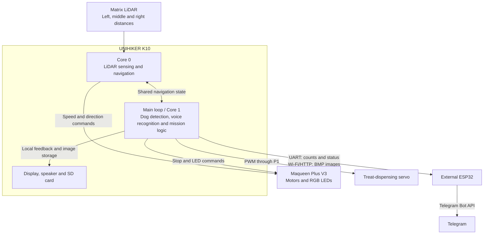

# Autonomous Dog Search Robot

[Add hero image]

An autonomous search robot built with UNIHIKER K10, Maqueen Plus V3, LiDAR, on-device AI and computer vision.

> *Big ideas don't always start with big problems. Sometimes they start with a dog named Benny.*

🎥 [Add 30-second demonstration video]

---

## Project Overview

This project is an autonomous search robot designed to locate dogs in a home environment. Built around the UNIHIKER K10 and Maqueen Plus V3, it integrates LiDAR-based obstacle detection, autonomous navigation, camera-based dog detection using on-device AI, motor control, local image storage and Telegram-based mission reporting.

The mission begins at power-on. The K10 continuously analyzes camera input and three directional LiDAR measurements. Together with a predefined search pattern, these inputs determine whether the robot continues forward or turns toward a clearer path. The K10 then sends speed and direction commands to the Maqueen Plus V3, which drives the motors.

When a dog is detected, the robot stops, captures and stores an image, activates the Maqueen LEDs and displays both a “Dog detected” message and the captured photo on the K10. It increments the detection counter, dispenses a treat through an integrated servo mechanism and sends a numbered Telegram notification via a separate ESP32 before resuming the search.

The mission ends when the K10 wake phrase is followed by the command “mission complete.” The robot stops, plays an audible completion message, reports the total number of detections and sends all captured images through Telegram.


---

## Why I Built This

Rather than only studying autonomous systems, I wanted to build one.

The mission is simple: find a missing dog. The engineering is not. This project combines LiDAR, autonomous navigation, computer vision, embedded systems and on-device AI.

Autonomous cars, search-and-rescue drones and planetary rovers operate on a much larger scale, but they rely on the same fundamentals: perception, navigation and intelligent decision-making. Their environments may be city streets, disaster zones or the surface of Mars. Mine is a living room. I wanted to explore those principles by scaling the challenge down to something small, real and close to home.

That is where Benny comes in.

Finding him somewhere in the house, possibly under the sofa, turned a collection of sensors, algorithms and hardware into an integrated autonomous prototype. Every part had to work toward one clear goal.

Every ambitious system starts as a smaller one that works. This is my first step.

Now the robot is here — ready to find Benny.

---

## Key Capabilities

- **Autonomous search:** Follows a predefined search pattern and navigates without manual control.
- **LiDAR-based obstacle avoidance:** Continuously analyzes three directional distance measurements to detect obstacles and select a clearer path.
- **On-device dog detection:** Processes live camera input locally on the UNIHIKER K10 using AI.
- **Automatic detection response:** Stops, captures an image and stores it on the SD card whenever a dog is detected.
- **Detection tracking:** Maintains a numbered counter of all dog detections recorded during the mission.
- **Visual and audible feedback:** Uses the K10 display, Maqueen LEDs and audio messages to communicate mission status.
- **Treat dispensing:** Activates an integrated servo-controlled mechanism after a successful dog detection.
- **Telegram reporting:** Sends numbered detection notifications during the mission and transmits the final detection count and captured images when the search ends.
- **Voice-triggered mission completion:** Ends the autonomous search when the command “Hi, Telly, mission complete” is recognized.
---

## System Architecture

The UNIHIKER K10 is the robot’s main processing and decision-making unit. It analyzes left, center and right LiDAR measurements, runs camera-based dog detection, makes navigation decisions, recognizes the mission-completion command and coordinates the overall search sequence.

To keep navigation responsive while the AI processes live camera input, the workload is divided between the K10’s two processor cores. A dedicated task handles LiDAR sensing and navigation, while the main program manages dog detection, image capture, voice recognition and mission logic.

The K10 sends speed and direction commands to the Maqueen Plus V3, which drives the motors and controls the RGB LEDs. The K10 also controls the treat dispenser, stores captured images on the SD card and provides local feedback through its display and speaker.

A separate ESP32 acts as the communication gateway. It receives detection counts and mission status from the K10 over UART, receives stored images over Wi-Fi using HTTP and forwards the notifications, mission summary and images to Telegram.




### Subsystem Responsibilities

| Subsystem | Main Responsibilities |
|---|---|
| UNIHIKER K10 | Processes live camera input, runs on-device dog detection, analyzes LiDAR data, makes navigation decisions and manages the overall mission logic. It also handles voice recognition, display and audio feedback, SD-card file operations, servo control and communication with the external ESP32. |
| Maqueen Plus V3 | Executes movement commands, drives the motors and provides RGB LED feedback. |
| Matrix LiDAR | Provides continuous left, middle and right distance measurements for obstacle detection and navigation. |
| Servo mechanism | Dispenses a treat after a confirmed dog detection, controlled directly by the K10. |
| SD card | Stores numbered BMP images and the recorded mission-completion audio locally. |
| External ESP32 | Receives detection counts and mission status over UART, receives BMP images over Wi-Fi using HTTP and forwards messages and images to Telegram. |
| Telegram | Provides remote dog-detection notifications, the final mission summary and access to the captured images. |

## Mission Workflow

The system architecture above shows how the subsystems are connected. The sequence below describes how they work together during a search mission.

### 1. Autonomous Search

- After startup and initialization, the robot begins searching without manual control.
- The K10 continuously processes live camera input while the navigation task reads the left, center and right LiDAR measurements.
- The predefined search pattern and LiDAR data determine the robot’s speed and direction.
- When an obstacle is detected, the robot slows down or stops, reverses and turns toward the side with more available space.

### 2. Dog Detection and Response

- When the on-device AI identifies a possible dog, navigation pauses while the detection is briefly confirmed.
- After confirmation, the robot stops, activates the Maqueen LEDs and increments the detection counter.
- A numbered BMP image is captured and saved to the SD card.
- The K10 sends the numbered detection event to the external ESP32, which forwards a Telegram notification.
- The treat-dispensing servo is activated, and the captured image is displayed on the K10.
- After displaying the result, the LEDs turn off and the robot returns to live camera mode. If no dog remains in view, the autonomous search continues; if a dog is still detected, navigation pauses again.

### 3. Mission Completion

- The search ends when the K10 wake phrase is followed by the command “mission complete.”
- The robot stops, displays the final detection count and plays the recorded completion message.
- A mission summary is sent to the external ESP32 over UART.
- The K10 uploads all stored images to the ESP32 over Wi-Fi using HTTP.
- The ESP32 forwards the mission summary and captured images to Telegram.

---


## Hardware

The prototype is built from commercially available embedded and robotics components, combined with a custom treat-dispensing mechanism.

| Component | Exact Model | Purpose |
|---|---|---|
| Main controller | UNIHIKER K10 | Runs camera processing, on-device AI, LiDAR navigation, voice recognition and mission logic |
| Robot platform | DFRobot Maqueen Plus V3 | Provides the chassis, motors, wheels and RGB LED feedback |
| Distance sensor | DFRobot Matrix LiDAR Distance Sensor | Provides left, center and right distance measurements for navigation and obstacle avoidance |
| Communication controller | ESP32 development board *[add exact model]* | Handles Telegram notifications, mission reporting and image transmission |
| Servo motor | *[add exact model]* | Operates the treat-dispensing mechanism |
| Storage | microSD card *[add capacity]* | Stores numbered BMP images and the recorded completion message |
| Power supply | *[add exact battery or battery pack]* | Powers the mobile robot system |
| Mechanical parts | Custom mounts and treat dispenser | Secures the electronics and releases a treat after a confirmed detection |

For exact part numbers, quantities, wiring and product references, see the [Bill of Materials](docs/bill-of-materials.md).

---

## Software

- Arduino IDE
- C++
- On-device AI
- Computer Vision
- Autonomous Navigation
- I²C Communication
- Git & GitHub

---

## Engineering Process

### Robot Platform

- Assembly
- Motor control
- K10–Maqueen communication

### Autonomous Navigation

- Navigation algorithm
- Obstacle avoidance
- Turning strategy
- Decision making

### LiDAR Integration

- Sensor communication
- Distance measurements
- Environment scanning
- Navigation input

### AI Dog Detection

- Camera testing
- On-device AI
- Detection accuracy
- Lighting conditions
- Testing methodology

### System Integration

- Combining all subsystems
- Full search sequence
- Debugging
- Problems encountered
- Solutions implemented

---

## Results & Evaluation

- Project photos
- Demonstration video
- Test scenarios
- Successful functions
- Current limitations
- Performance evaluation

---

## What You'll Find in This Repository

- Complete source code
- Hardware documentation
- System architecture
- Development process
- Engineering challenges
- Testing methodology
- Technical report
- Photos and demonstration videos

---

## Repository Structure

```text
autonomous-dog-search-robot/
│
├── src/          Source code
├── docs/         Documentation
├── media/        Images and videos
├── hardware/     Wiring diagrams and components
├── tests/        Test programs and results
├── report/       Technical report
└── README.md
```

---

## Next Steps

- Improve localization
- Explore SLAM-based navigation
- Add room mapping
- Improve AI detection robustness
- Implement treat dispenser
- Log search missions
- Send detection notifications

---

## Technical Report

This repository includes documentation covering:

- Design process
- Hardware design
- Software architecture
- Engineering decisions
- Testing
- Challenges
- Results

📄 [Add report link]

---

## Author

**Filippa Bodecker**

MSc Student in Electrical Engineering  
Faculty of Engineering (LTH), Lund University
