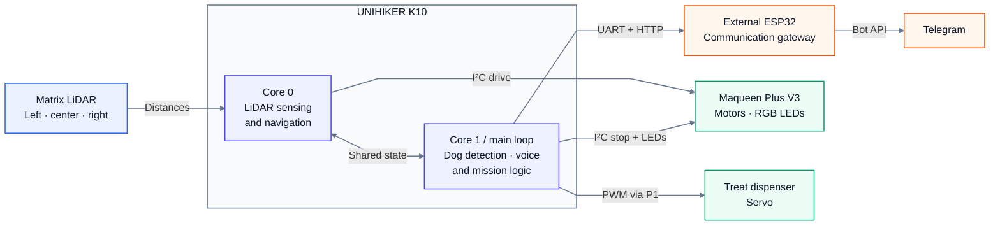

# Autonomous Dog Search Robot

[Add hero image]

An autonomous search robot built with UNIHIKER K10, Maqueen Plus V3, LiDAR, on-device AI and computer vision.

> *Big ideas don't always start with big problems. Sometimes they start with a dog named Benny.*

🎥 [Add 30-second demonstration video]

---

## Project Overview

This project presents an autonomous indoor search robot designed to locate dogs in a home environment. Built around the UNIHIKER K10 and Maqueen Plus V3, it integrates LiDAR-based obstacle detection, autonomous navigation, camera-based dog detection using on-device AI, motor control, local image storage and Telegram-based mission reporting.

The mission begins at power-on. The K10 continuously analyzes camera input and three directional LiDAR measurements. Together with a predefined search pattern, these inputs determine whether the robot continues forward or turns toward a clearer path. The K10 then sends speed and direction commands to the Maqueen Plus V3, which drives the motors.

When a dog is detected, the robot stops, captures and stores an image, activates the Maqueen LEDs and displays both a “Dog detected” message and the captured photo on the K10. It increments the detection counter, dispenses a treat through an integrated servo mechanism and sends a numbered Telegram notification via a separate ESP32 before resuming the search.

The mission ends when the K10 wake phrase is followed by the command “mission complete.” The robot stops, plays an audible completion message, reports the total number of detections and sends all captured images through Telegram.


---

## Why I Built This

Rather than only studying autonomous systems, I wanted to build one.

The mission is simple: find a missing dog. The engineering is not. This project combines LiDAR, autonomous navigation, computer vision, embedded systems and on-device AI.

Autonomous cars, search-and-rescue drones and planetary rovers operate on a much larger scale, but they rely on the same fundamentals: perception, navigation and intelligent decision-making. Their environments may be city streets, disaster zones or the surface of Mars. Mine is a living room. I wanted to explore those principles by scaling the challenge down to something small, real and close to home.

That is where Benny comes in.

Finding him somewhere in the house, possibly under the sofa, turned a collection of sensors, algorithms and hardware into an integrated autonomous prototype. Every part had to work toward one clear goal.

Every ambitious system starts as a smaller one that works. This is my first step.

Now the robot is here — ready to find Benny.

---

## Key Capabilities

- **Autonomous search:** Follows a predefined search pattern and navigates without manual control.
- **LiDAR-based obstacle avoidance:** Continuously analyzes three directional distance measurements to detect obstacles and select a clearer path.
- **On-device dog detection:** Processes live camera input locally on the UNIHIKER K10 using AI.
- **Automatic detection response:** Stops, captures an image and stores it on the SD card whenever a dog is detected.
- **Detection tracking:** Maintains a numbered counter of all dog detections recorded during the mission.
- **Visual and audible feedback:** Uses the K10 display, Maqueen LEDs and audio messages to communicate mission status.
- **Treat dispensing:** Activates an integrated servo-controlled mechanism after a successful dog detection.
- **Telegram reporting:** Sends numbered detection notifications during the mission and transmits the final detection count and captured images when the search ends.
- **Voice-triggered mission completion:** Ends the autonomous search when the command “Hi, Telly, mission complete” is recognized.
---

## System Architecture

The UNIHIKER K10 is the robot’s main processing and decision-making unit. It analyzes left, center and right LiDAR measurements, runs camera-based dog detection, makes navigation decisions, recognizes the mission-completion command and coordinates the overall search sequence.

To keep navigation responsive while the AI processes live camera input, the workload is divided between the K10’s two processor cores. A dedicated task handles LiDAR sensing and navigation, while the main program manages dog detection, image capture, voice recognition and mission logic.

The K10 sends speed and direction commands to the Maqueen Plus V3, which drives the motors and controls the RGB LEDs. The K10 also controls the treat dispenser, stores captured images on the SD card and provides local feedback through its display and speaker.

A separate ESP32 acts as the communication gateway. It receives detection counts and mission status from the K10 over UART, receives stored images over Wi-Fi using HTTP and forwards the notifications, mission summary and images to Telegram.



---

## Mission Workflow

The system architecture above shows how the subsystems are connected. The sequence below describes how they work together during a search mission.

### 1. Autonomous Search

- After startup and initialization, the robot begins searching without manual control.
- The K10 continuously processes live camera input while the navigation task reads the left, center and right LiDAR measurements.
- The predefined search pattern and LiDAR data determine the robot’s speed and direction.
- When an obstacle is detected, the robot slows down or stops, reverses and turns toward the side with more available space.

### 2. Dog Detection and Response

- When the on-device AI identifies a possible dog, navigation pauses while the detection is confirmed.
- After confirmation, the robot stops, activates the Maqueen LEDs and increments the detection counter.
- A numbered BMP image is captured and saved to the SD card.
- The K10 sends the numbered detection event to the external ESP32, which forwards a Telegram notification.
- The treat-dispensing servo is activated, and the captured image is displayed on the K10.
- After displaying the result, the LEDs turn off and the robot returns to live camera mode. If no dog remains in view, the autonomous search continues; if a dog is still detected, navigation pauses again.

### 3. Mission Completion

- The search ends when the K10 wake phrase is followed by the command “mission complete.”
- The robot stops, displays the final detection count and plays the recorded completion message.
- A mission summary is sent to the external ESP32 over UART.
- The K10 uploads all stored images to the ESP32 over Wi-Fi using HTTP.
- The ESP32 forwards the mission summary and captured images to Telegram.

---


## Hardware

The prototype combines off-the-shelf robotics components with a custom treat dispenser.

| Component | Exact Model | Purpose |
|---|---|---|
| Main controller | UNIHIKER K10 | Runs camera processing, on-device AI, LiDAR navigation, voice recognition and mission logic |
| Robot platform | DFRobot Maqueen Plus V3 (MBT0050-18650) | Provides the chassis, motors, wheels and RGB LED feedback |
| Distance sensor | DFRobot Matrix Laser Ranging Sensor (included with Maqueen Plus V3) | Provides left, center and right distance measurements for navigation and obstacle avoidance |
| Communication controller | DUBEUYEW ESP32-DevKitC V1 (30-pin) | Handles Telegram notifications, mission reporting and image transmission |
| Servo motor | DFRobot 9g Metal Gear Servo (micro:Maqueen Mechanic kit) | Operates the treat-dispensing mechanism |
| Storage | 32 GB microSD card | Stores numbered BMP images and the recorded completion message |
| Power supply | 1 × rechargeable 18650 Li-ion battery | Powers the mobile robot system |
| Mechanical parts | Repurposed micro:Maqueen Mechanic parts and custom treat dispenser | Secures the servo and releases a treat after a confirmed detection |

For exact part numbers, quantities, wiring and product references, see the [Bill of Materials](docs/bill-of-materials.md).

---

## Software

The software is written in C++ and divided between two embedded controllers. The UNIHIKER K10 runs the robot’s main application, while a separate ESP32 handles image transfer and Telegram communication.

### Software Components

| Area | Technology | Role in the System |
|---|---|---|
| Programming language | C++ | Used to write the software for both the K10 and the external ESP32 |
| K10 development environment | Mind+ | Used to develop and upload the main robot program |
| ESP32 development environment | Arduino IDE | Used to develop and upload the ESP32 communication program |
| Task management | FreeRTOS | Runs LiDAR navigation in parallel with AI and mission control |
| On-device AI | DFRobot AIRecognition library | Analyzes live camera input to detect dogs |
| Voice recognition | DFRobot ASR library | Recognizes the command that ends the mission |
| Robot control | DFRobot Maqueen Plus library | Controls the motors and RGB LEDs |
| Distance sensing | DFRobot Matrix LiDAR library | Reads distance measurements from the left, center and right |
| Local storage | SD card and LittleFS | Stores images on the K10 and temporarily stores transferred images on the ESP32 |
| Communication | I²C, UART, Wi-Fi, HTTP and HTTPS | Transfers sensor data, movement commands, mission events and images |

### Application Structure 

The source code is divided into two applications:

- **[UNIHIKER K10 application](src/k10/):** Main robot software
- **[ESP32 communication gateway](src/esp32/):** Image transfer and Telegram communication

```text
src/
├── k10/
│   └── autonomous_dog_search_robot.cpp
└── esp32/
    └── telegram_gateway.ino
```
---

## Engineering Challenges and Design Decisions

The final architecture was shaped by challenges that appeared when the individual subsystems were combined. The most important decisions involved separating AI from network communication, running navigation and AI in parallel, converting LiDAR measurements into useful movement and coordinating the complete dog-detection response.

### 1. Separating AI and Network Communication

**Challenge:**  
The K10 AI application and the Telegram communication program both worked correctly on their own. However, combining them in a single Mind+ project caused linker errors involving duplicate definitions of `SPIFFS`, `lv_qrcode`, `qrcodegen` and the ESP32 `RMT` driver.

**Root cause:**  
After several attempts to isolate the problem, DFRobot support confirmed that it was caused by an architectural limitation in the Mind+ `AIRecognition` library. The library already includes several ESP32 system components that conflict with components used by the Wi-Fi and HTTPS libraries. The problem was therefore not caused by the application logic.

**Design decision:**  
Instead of removing either AI or Telegram communication, the software was divided between two controllers:

- The UNIHIKER K10 handles AI, navigation and mission control.
- A separate ESP32 handles Wi-Fi, HTTPS and Telegram communication.

Short mission events, such as detection counts and mission status, are sent from the K10 to the ESP32 over UART. Larger BMP image files are transferred separately over Wi-Fi using HTTP.

**Result:**  
The two-controller design resolved the library conflicts while preserving both on-device AI and Telegram reporting. It also gave each controller a clear role.

### 2. Running Navigation and AI in Parallel

**Challenge:**  
The robot must continuously process camera input for dog detection while also reading LiDAR data and reacting to obstacles. Running these tasks only as one sequential program could make navigation less responsive while the AI and mission logic were active.

**Design decision:**  
The workload was divided between the K10’s two processor cores using FreeRTOS:

- **Core 0** runs a dedicated LiDAR sensing and navigation task.
- **Core 1** runs dog detection, voice recognition, image handling and mission logic.

Shared navigation states allow the AI logic to pause the motors immediately when a possible dog is detected and resume the search when the detection sequence is complete.

**Result:**  
Navigation and AI run in parallel and coordinate through shared navigation states. This keeps obstacle avoidance responsive while the camera is continuously analyzed for dogs.

### 3. Turning LiDAR Measurements into Navigation

**Challenge:**  
The Matrix LiDAR provides left, center and right distance measurements, but the raw values do not directly tell the robot how fast to move or which direction to choose.

**Design decision:**  
A rule-based navigation strategy was developed around the three measurements:

- The robot adjusts its speed according to the available distance ahead.
- Small steering corrections begin before an obstacle becomes critical.
- When an obstacle is too close, the robot stops, reverses and turns toward the side with more available space.
- Repeated obstacles trigger progressively larger turns.
- A predefined search pattern introduces periodic direction changes to support exploration beyond simple obstacle avoidance.

**Result:**  
The robot can navigate and search an indoor environment without manual control, adapting its speed and direction to nearby obstacles. The system is intentionally reactive: it uses current LiDAR measurements rather than mapping, localization or SLAM.

### 4. Coordinating Dog Detection and Mission State

**Challenge:**  
A momentary AI result should not immediately trigger the full response sequence. The robot also has to stop safely, record the detection and prevent overlapping actions while the image, treat dispenser and user feedback are being handled.

**Design decision:**  
A possible dog must remain visible for a short confirmation period and meet a minimum image-size requirement. Navigation pauses as soon as a possible dog appears. After confirmation, the program uses shared mission states to coordinate stopping, image capture, detection counting, LED feedback, treat dispensing and Telegram reporting.

The robot returns to live camera mode after displaying the captured image. If no dog remains visible, navigation resumes. If a dog is still detected, navigation pauses again.

**Result:**  
The detection response follows one coordinated sequence, allowing navigation, image capture, storage, treat dispensing and communication to work together without conflicting actions.


---

## Results and Evaluation

The final prototype integrates navigation, dog detection and mission reporting into one autonomous search sequence.

### Functional Validation

The prototype was validated continuously throughout development through subsystem and integration testing. Individual functions were first tested independently and then verified as part of the complete mission workflow.

Validation covered LiDAR-based navigation, dog detection, image capture, detection tracking, treat dispensing, Telegram reporting and voice-triggered mission completion.

### Current Limitations

- The navigation system is reactive and does not build a map or track the robot’s position.
- The predefined search pattern does not guarantee complete room coverage.
- The same dog may be counted more than once if it remains in or reappears in the camera view.
- Dog detection can be affected by distance, viewing angle and lighting conditions.
- Telegram reporting requires an available Wi-Fi connection.
- The current prototype has primarily been evaluated in controlled indoor environments.

---

## Future Work

- Reduce repeated detections of the same dog.
- Improve room coverage and reduce repeated search paths.
- Test dog detection at more distances, angles and lighting conditions.
- Improve navigation in narrow and cluttered spaces.
- Explore localization, room mapping and SLAM.
- **Long-term integration:** Pair the search robot with a separate solar-tracking robot built on the Maqueen Plus V2 for overnight charging.

---

## Project Resources

- [Source code](src/)
- [Bill of Materials](docs/bill-of-materials.md)
- [Images and demonstrations](media/)
  
---

## Author

**Filippa Bodecker**

MSc student in Electrical Engineering  
Faculty of Engineering (LTH), Lund University

